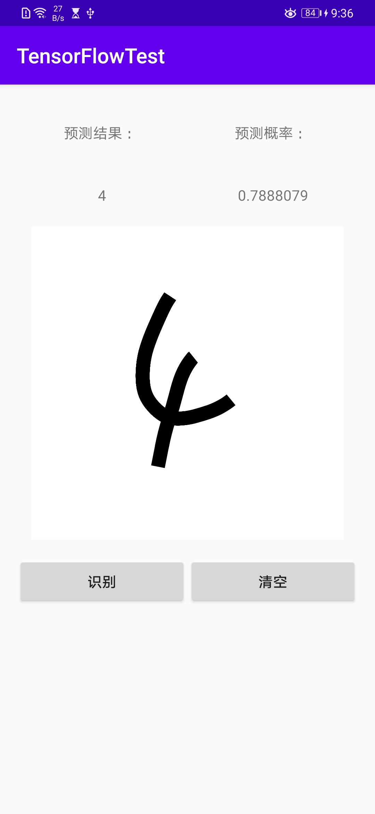

<!--
 * @Author: wuwuwu
 * @Date: 2020-04-20 17:07:05
 * @LastEditors: wuwuwu
 * @LastEditTime: 2020-04-26 10:17:23
 * @Description: 
 -->
# TensorFlow Lite

## 1、训练模型
在`model/`文件夹下的`MNIST.py`为模型训练文件，训练完成后使用SavedModel保存模型。

```python
tf.saved_model.save(model, "saved/1")
```

## 2、模型转换

这里使用**命令行工具**

在`model/`文件夹中打开cmd，输入`tflite_convert --saved_model_dir=saved/1 --output_file=mnist_savedmodel.tflite`，之后可以在该文件夹（**注意是`model/`文件夹下**）可以看到转换成`.tflite`的文件

将该文件复制到我们的Android项目的`app/src/main/assets`下

```java
assets
     |__mnist_savedmodel.tflite
```

## 3、Android依赖

1. 在`build.gradle`中的`android`下添加以下内容，支持armeabi-v7a
```java
ndk{
    abiFilters 'armeabi-v7a'
}
```

2. 添加以下内容，保证.tflite文件不被压缩
```java
aaptOptions {
    noCompress "tflite" // 编译apk时，不压缩tflite文件
    noCompress "lite"
}
```

3. 在`dependencies`中添加TensorFlow依赖
```java
implementation 'org.tensorflow:tensorflow-lite:2.1.0'
```

[org.tensorflow:tensorflow-lite 的最新版本号可以在这里查询](https://bintray.com/google/tensorflow/tensorflow-lite)

## 4、Android代码

在`Classifier.java`文件中作为分类

```java
// 加载训练模型
private MappedByteBuffer loadModelFile(AssetManager assetManager, String modelPath) throws IOException {
    // 加载模型
    AssetFileDescriptor fileDescriptor = assetManager.openFd(modelPath);
    // 文件描述传递到文件流入流对象
    FileInputStream inputStream = new FileInputStream(fileDescriptor.getFileDescriptor());
    // Channel、startOffset、declaredLength
    FileChannel fileChannel = inputStream.getChannel();
    Long startOffset = fileDescriptor.getStartOffset();
    Long declaredLengths = fileDescriptor.getDeclaredLength();
    // 映射该文件通道以读取模型的原始字节
    return  fileChannel.map(FileChannel.MapMode.READ_ONLY, startOffset, declaredLengths);
}
```

```java
// 将输入的Bitmap转化为Interpreter可以识别的ByteBuffer
private ByteBuffer convertBitmapToByteBuffer(Bitmap bitmap) {

    ByteBuffer byteBuffer = ByteBuffer.allocateDirect(4 * BATCH_SIZE * INPUT_HEIGHT * INPUT_WIDTH * INPUT_CHANNELS);
    byteBuffer.order(ByteOrder.nativeOrder());
    int[] intValues = new int[INPUT_HEIGHT * INPUT_WIDTH];

    bitmap.getPixels(intValues, 0, bitmap.getWidth(), 0, 0, bitmap.getWidth(), bitmap.getHeight());
    int pixel = 0;
    for (int i = 0; i < INPUT_WIDTH; i++){
        for (int j = 0; j < INPUT_HEIGHT; j++){
            int input = intValues[pixel++];
            float r = input >> (16) & 0xFF;
            float g = input >> (8) & 0xFF;
            float b = input & 0xFF;
            float gray = (255.0f - (r * 0.2126f + g * 0.7152f + b * 0.0722f)) / 255.0f;
            if (gray > 1.0f){
                gray = 1.0f;
            }
            else if (gray < 0){
                gray = 0.0f;
            }
            Log.d(TAG, "convertBitmapToByteBuffer: " + i + j + gray);
            byteBuffer.putFloat(gray);
        }
    }
    return byteBuffer;
}
```

```java
// 识别结果
public Result recognizeImage(Bitmap bitmap){
    // 图片转为输入大小
    Bitmap scaledBitmap = Bitmap.createScaledBitmap(bitmap, INPUT_WIDTH, INPUT_HEIGHT, false);
    ByteBuffer byteBuffer = convertBitmapToByteBuffer(scaledBitmap);
    // 1 * 10 数组，有10个label
    // 运行结束后，每个二级元素都是一个label的概率
    interpreter.run(byteBuffer, mResult);
    return new Result(mResult[0]);
}
```

`MainActivity.java`中实例化`Classifier`类，调用`recognizeImage()函数`

## 5、结果

