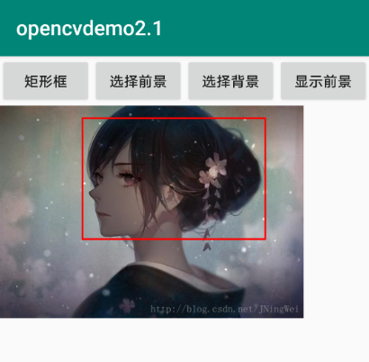
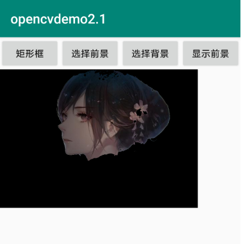

<!--
 * @Author: wuwuwu
 * @Date: 2020-01-23 11:57:59
 * @LastEditors: wuwuwu
 * @LastEditTime: 2020-04-07 17:43:08
 * @Description: 
 -->
# grabCut抠图之三
grabCut抠图系列应该算是完结了，后期的话可能就是采用深度学习的方法来实现抠图，主要接触移动端的深度学习模型部署

效果图如下：




## 代码说明

### DrawView控件

#### 1、触屏效果

```java
public boolean onTouchEvent(MotionEvent event)
    {
        clickX = event.getX();
        clickY = event.getY();
        if(event.getAction() == MotionEvent.ACTION_DOWN){

            isMove = false;
            startRectX = clickX;
            startRectY = clickY;
            startLineX = clickX;
            startLineY = clickY;
            invalidate();
            return true;
        }
        else if(event.getAction() == MotionEvent.ACTION_MOVE){

            isMove = true;
            invalidate();
            return true;
        }

        return super.onTouchEvent(event);
    }
```

#### 2、交互式画刷

```java
canvas : 画布，即可以绘制的部分;
    |
    |--drawLine(float startX, float startY, float stopX, float stopY, Paint paint);
    |--drawRect(float left, float top, float right, float bottom, Paint paint);
paint : 画笔，即绘制的工具;
mask : 蒙版，用于分割计算
```

```java
public Bitmap HandWriting(Bitmap originalBitmap)
    {
        Canvas canvas = null;

        canvas = new Canvas(originalBitmap);
        paint = new Paint();
        paint.setStyle(Paint.Style.STROKE);
        paint.setAntiAlias(true);
        paint.setColor(color);
        paint.setStrokeWidth(strokeWidth);
        if(isMove){
            if(mode == drawWithLinebg){
                canvas.drawLine(startLineX, startLineY, clickX, clickY, paint);
                mask.put((int)clickX, (int)clickY, 0);
                startLineX = clickX;    //更新位置，以极小的间隙逼近连续效果
                startLineY = clickY;
            }
            else if(mode == drawWithLinefg){
                canvas.drawLine(startLineX, startLineY, clickX, clickY, paint);
                mask.put((int)clickX, (int)clickY, 1);
                startLineX = clickX;    //更新位置，以极小的间隙逼近连续效果
                startLineY = clickY;
            }
            else if (mode == drawWithRect){
                paint.setColor(Color.RED);
                canvas.drawRect(startRectX, startRectY, clickX, clickY, paint);
            }
        }

        return originalBitmap;
    }
```

#### 3、分割算法

使用grabCut算法，具体原理可以[参考](https://blog.csdn.net/zouxy09/article/details/8534954)

这里因为是demo，所以直接在Java层实现，运行速度较慢，可以**转为JNI代码，并使用release编译，运行速度会得到明显改善**

```java
public void showFront(){
        //显示前景
        new2Bitmap = Bitmap.createBitmap(originalBitmap);
        Mat src = new Mat();   //将原图转为Mat类型
        Mat dst = new Mat();
        Mat result = new Mat();
        Mat fgModel = new Mat();
        Mat bgModel = new Mat();
        Utils.bitmapToMat(new2Bitmap, src); //转为Mat类型
        Imgproc.cvtColor(src, src, Imgproc.COLOR_BGRA2BGR);
        Rect rect = new Rect(new Point((int)startRectX, (int)startRectY), new Point((int)clickX, (int)clickY));
        int spiltmode = Imgproc.GC_INIT_WITH_RECT;
        if(mode == drawWithLinebg || mode == drawWithLinefg){
            spiltmode = Imgproc.GC_INIT_WITH_MASK;
        }
        Imgproc.grabCut(src, mask, rect, bgModel, fgModel, 3, spiltmode);   //进行GrabCut操作
        compare(mask, new Scalar(3), mask, 0);
        guideFilter();  //进行引导滤波
        show = true;
        src.release();
        dst.release();
        bgModel.release();
        fgModel.release();
        result.release();
    }
```

#### 4、引导滤波

引导滤波算法原理[参考](https://blog.csdn.net/sinat_36264666/article/details/77990790)

java层实现：
```java
public void guideFilter(){
        new2Bitmap = Bitmap.createBitmap(originalBitmap);
        //将mask转为bitmap，便于处理
        Bitmap binaryBitmap = Bitmap.createBitmap(new2Bitmap.getWidth(), new2Bitmap.getHeight(),Bitmap.Config.ARGB_8888);
        Utils.matToBitmap(mask, binaryBitmap);
        //引导滤波
        GuideFilter(new2Bitmap, binaryBitmap);
    }
```
JNI调用：

JNI C++代码使用，需要先配置opencv环境，注意cmake。

```java
extern "C" JNIEXPORT void JNICALL
Java_com_example_opencvdemo2_DrawView_GuideFilter(
        JNIEnv *env, jclass type, jobject bitmapI, jobject bitmapP){
    if (bitmapI == NULL || bitmapP == NULL){
        return;
    }
    AndroidBitmapInfo infoI, infoP;
    memset(&infoI, 0, sizeof(infoI));   //初始化置零
    memset(&infoP, 0, sizeof(infoP));   //初始化置零
    AndroidBitmap_getInfo(env, bitmapI, &infoI);    //获取图片信息
    AndroidBitmap_getInfo(env, bitmapP, &infoP);
    void *pixelsI = NULL;
    AndroidBitmap_lockPixels(env, bitmapI, &pixelsI);   //获取像素
    Mat I(infoI.height, infoI.width, CV_8UC4, pixelsI); //创建Mat对象，并将像素进行赋值
    Mat gray;
    cvtColor(I, gray, CV_BGRA2GRAY);    //注意Bitmap Config。8888对于BGRA通道
    cvtColor(I, I, CV_BGRA2RGB);        //转为RGB通道
    gray.convertTo(gray, CV_64FC1, 1.0 / 255);

    void *pixelsP = NULL;
    AndroidBitmap_lockPixels(env, bitmapP, &pixelsP);
    Mat P(infoP.height, infoP.width, CV_8UC4, pixelsP);
    cvtColor(P, P, CV_BGRA2GRAY);
    P.convertTo(P, CV_64FC1, 1.0 / 255);

    int r1 = I.cols / 100;          //引导滤波参数设置
    if (I.cols > I.rows){
        r1 = I.rows / 100;
    }
    Mat output = guidefilter(gray, P, r1, 0.001);

    output.convertTo(output, CV_8UC1);
    Mat dst[3] = {output, output, output};
    Mat dsts;
    merge(dst, 3, dsts);
    Mat result = dsts.mul(I);

    int a = 0, r = 0, g = 0, b = 0;

    for (int y = 0; y < infoI.height; ++y) {
        for (int x = 0; x < infoI.width; ++x) {
            int *pixel = NULL;
            pixel = ((int *) pixelsI) + y * infoI.width + x;
            r = result.at<Vec3b>(y, x)[0];
            g = result.at<Vec3b>(y, x)[1];
            b = result.at<Vec3b>(y, x)[2];
            a = RGBA_A(*pixel);
            *pixel = MAKE_RGBA(r, g, b, a);
        }
    }
    AndroidBitmap_unlockPixels(env, bitmapI);   //释放
    AndroidBitmap_unlockPixels(env, bitmapP);
}
```